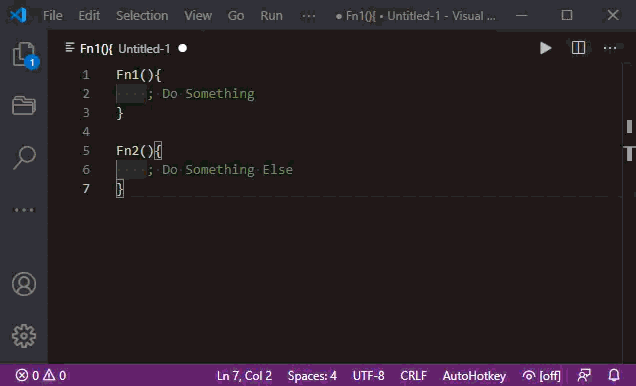

# VSCode-AutoHotkey-Easy-Folding

A simple script to facilitate the easy creation of folding block comments and folding regions.

Requires the following code to exist in the AutoHoteky language extensions ahk.settings.json file.

    // Folding regions marked by ";region" and ";endregion" comments.
    // Folding block comments marked by "/* ;region" and "*/ ;endregion" comments.
    "folding": {
        "markers": {
            "start": "^\\s*\\;\\s*region\\b",
            "end": "^\\s*\\;\\s*endregion\\b"
        }
    }

